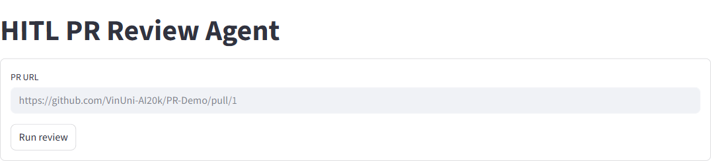
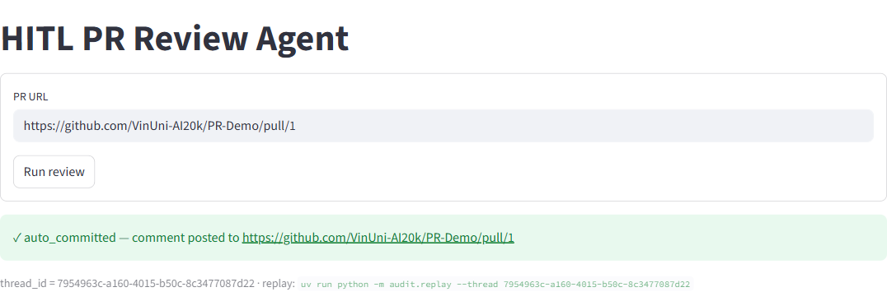

# Báo cáo bài lab Day27 — Track 3: HITL PR Review Agent

**Sinh viên:** Nguyễn Huy Tú  
**MSV:** 2A202600170

## 1. Mục tiêu bài lab

Bài lab triển khai một hệ thống Human-in-the-Loop Pull Request Review Agent dùng LangGraph. Agent có khả năng đọc pull request, phân tích diff bằng LLM, định tuyến theo độ tự tin, yêu cầu con người phê duyệt khi cần, ghi audit trail vào SQLite và cung cấp giao diện Streamlit để reviewer thao tác trên trình duyệt.

## 2. Môi trường và cấu hình

Đã cài dependency bằng `uv` và tạo môi trường `.venv`:

```bash
uv sync
```

`GITHUB_TOKEN` được lấy tự động từ GitHub CLI bằng `gh auth token` và ghi vào `.env`. File `.env` không nên commit lên repository.

## 3. Nội dung đã thực hiện

### Exercise 1 — Confidence routing

Đã hoàn thiện `exercises/exercise_1_confidence.py`:

- Gọi LLM với structured output `PRAnalysis`.
- Phân tích title và diff của pull request.
- Đọc `analysis.confidence` để định tuyến theo threshold:
  - `confidence >= AUTO_APPROVE_THRESHOLD` → `auto_approve`
  - `confidence < ESCALATE_THRESHOLD` → `escalate`
  - còn lại → `human_approval`
- Hoàn thiện LangGraph gồm các node:
  - `fetch_pr`
  - `analyze`
  - `route`
  - `auto_approve`
  - `human_approval`
  - `escalate`

### Exercise 2 — HITL với `interrupt()`

Đã hoàn thiện `exercises/exercise_2_hitl.py`:

- Node `human_approval` gọi `interrupt()` với payload gồm:
  - loại request `approval_request`
  - PR URL
  - confidence
  - confidence reasoning
  - summary
  - proposed comments
  - diff preview
- Graph được compile với `MemorySaver()` checkpointer để resume được.
- Hoàn thiện vòng lặp resume bằng `Command(resume=answer)`.
- Người dùng có thể chọn `approve`, `reject`, hoặc `edit` từ terminal.

### Exercise 3 — Escalation Q&A

Đã hoàn thiện `exercises/exercise_3_escalation.py`:

- Bổ sung prompt yêu cầu LLM sinh `escalation_questions` khi confidence thấp.
- Node `escalate` gọi `interrupt()` với payload gồm:
  - `kind="escalation"`
  - confidence
  - reasoning
  - summary
  - risk factors
  - danh sách câu hỏi cần reviewer trả lời
- Node `synthesize` re-prompt LLM bằng:
  - diff gốc
  - phân tích ban đầu
  - câu trả lời của reviewer
- Graph đã nối nhánh:

```text
escalate -> synthesize -> commit
```

### Exercise 4 — Structured SQLite audit trail

Đã hoàn thiện `exercises/exercise_4_audit.py`:

- Implement helper `audit(...)` để gọi `write_audit_event(...)`.
- Ghi `AuditEntry` ở các node quan trọng:
  - `fetch_pr`
  - `analyze`
  - `route`
  - `human_approval` trước và sau interrupt
  - `escalate` trước và sau interrupt
  - `synthesize`
  - `commit`
  - `auto_approve`
- Mỗi audit row có các trường chính:
  - `agent_id`
  - `action`
  - `confidence`
  - `risk_level`
  - `reviewer_id`
  - `decision`
  - `reason`
  - `execution_time_ms`
- Graph sử dụng `AsyncSqliteSaver` để checkpoint và resume durable qua SQLite.

### Exercise 5 — Streamlit approval UI

Đã hoàn thiện `app.py`:

- Import và sử dụng `build_graph` từ Exercise 4.
- Chạy graph với `AsyncSqliteSaver`.
- Lưu `thread_id`, `pr_url`, interrupt payload và final result trong `st.session_state`.
- Render approval card cho nhánh `human_approval`:
  - hiển thị confidence
  - reasoning
  - summary
  - comments
  - diff preview
  - nút `Approve`, `Reject`, `Edit`
- Render escalation card cho nhánh `escalate`:
  - hiển thị risk factors
  - summary
  - form trả lời từng câu hỏi escalation
- Resume graph bằng `Command(resume=...)` sau khi reviewer thao tác.
- Sidebar hiển thị các recent sessions từ bảng `audit_events`.

## 4. Các lệnh kiểm tra đã chạy

Đã cài dependency:

```bash
uv sync
```

Đã kiểm tra syntax toàn bộ source Python:

```bash
uv run python -m compileall common exercises audit app.py
```

Kết quả: pass.

Đã smoke test các graph builder:

```bash
uv run python - <<'PY'
from exercises.exercise_1_confidence import build_graph as build_graph_1
from exercises.exercise_2_hitl import build_graph as build_graph_2
from exercises.exercise_3_escalation import build_graph as build_graph_3
from exercises.exercise_4_audit import build_graph as build_graph_4
from langgraph.checkpoint.memory import MemorySaver

build_graph_1()
build_graph_2()
build_graph_3()
build_graph_4(MemorySaver())
print('graph builders ok')
PY
```

Kết quả:

```text
graph builders ok
```

Đã chạy Streamlit UI:

```bash
uv run streamlit run app.py --server.port 8501 --server.headless true
```

Kết quả HTTP local:

```text
http://localhost:8501 trả về 200 OK
```

Đã chạy review trên PR demo:

```text
https://github.com/VinUni-AI20k/PR-Demo/pull/1
```

Kết quả trên UI:

```text
✓ auto_committed — comment posted to https://github.com/VinUni-AI20k/PR-Demo/pull/1
thread_id = 7954963c-a160-4015-b50c-8c3477087d22
```

## 5. Minh chứng giao diện Streamlit

### Màn hình nhập PR URL



### Màn hình kết quả sau khi chạy review



## 6. Cách chạy chương trình

Chạy Exercise 1:

```bash
uv run python exercises/exercise_1_confidence.py --pr https://github.com/VinUni-AI20k/PR-Demo/pull/1
uv run python exercises/exercise_1_confidence.py --pr https://github.com/VinUni-AI20k/PR-Demo/pull/2
```

Chạy Exercise 2:

```bash
uv run python exercises/exercise_2_hitl.py --pr https://github.com/VinUni-AI20k/PR-Demo/pull/1
```

Chạy Exercise 3:

```bash
uv run python exercises/exercise_3_escalation.py --pr https://github.com/VinUni-AI20k/PR-Demo/pull/2
```

Chạy Exercise 4 và replay audit:

```bash
uv run python exercises/exercise_4_audit.py --pr https://github.com/VinUni-AI20k/PR-Demo/pull/1
uv run python -m audit.replay --list
uv run python -m audit.replay --thread <thread_id>
```

Chạy Streamlit UI:

```bash
uv run streamlit run app.py
```

## 7. Lưu ý bảo mật

- Không commit `.env` vì có chứa token.
- `GITHUB_TOKEN` chỉ nên lấy từ GitHub CLI hoặc biến môi trường cục bộ.
- Các flow `auto_approve`, `commit`, và approve trong HITL có thể post comment thật lên GitHub PR.
- Khi chỉ muốn kiểm tra compile/import, không nên chạy các flow có side-effect post comment nếu chưa sẵn sàng.

## 8. Kết luận

Bài lab đã được hoàn thiện theo yêu cầu: agent có confidence routing, HITL interrupt/resume, escalation Q&A, audit trail bằng SQLite và giao diện Streamlit để reviewer thao tác. Các kiểm tra syntax và graph builder đều chạy thành công.
